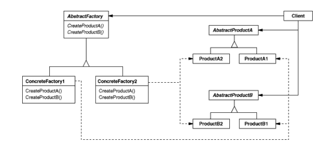

# Prototype

## Намерение
Осигурява интерфейс за създаване на семейства от обекти, които са свързани и зависими помежду си, без да се посочват техните конкретни класове.
(Също известен като Kit)

## Мотив
С цел да се предотврати модуларизацията се използва този шаблон. 
Също се използва в системи, които често подлежат на промени.

## Участници
#### Abstract Factory:
Декларира интерфейс за операциите по създаването на абстрактни продукти.
#### Concrete Factory:
Имплементира опериациите, по които ще се създават конкретните продукти.
#### Abstract Product:
Декларира интерфейс за даден тип обект.
#### Concrete Product:
Дефинира конкретния обект, който ще бъде създаден от конкретната фабрика.
Имплементира Abstract Product.
#### Client:
Използва само интерфейси, декларирани от Abstract Factory и Abstract Product.

## Приложимост
Използвайте шаблона Abstract Factory, когато:
*   Дадена система трябва да бъде независима от това как нейните продукти създадени.	
*   Системата трябва да бъде конфигурирана с една от множеството семейства от обекти.
*   Когато искаш да предоставиш клас библиотека от обекти, но искаш да бъдат известни само техните интерфейси, а не тяхните имплементации.

## Свързани шаблони
Abstract Factory класовете са често имплементирани с Factory Method шаблонът, но те могат също така да бъдат имплементирани, използвайки Prototype шаблона.
Конретен Factory е чесно Sigleton.

## Структура

