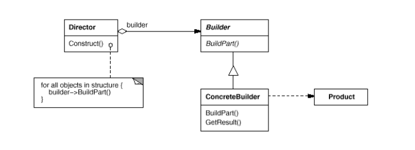

# Builder

## Намерение
Този дизайн шаблон разделя и изолира логиката по създаването на сложен обект от тази тази за неговото представяне и използване. Така един и същ процес на конструиране може да създаде различни обекти, с различно представяне и данни.
Дефинира инстанция за създаването на обекти, но оставя на подкласовете да решат кой точно клас да инстанцират.
Този дизайн шаблон го използваме когато имаме постъпков процес по създаване на обект.

## Мотивация
Шаблонът енкапсулира и опростява самото създаване на обекта. Скрива логиката и стъпките по неговото създаване. Чрезнего се предотвратява подаването на множество параметри и dependency-та.

## Участници
#### Director: 
Тук се намира логиката по създаването на обекта. Той знае как се конструира самия обект, стъпките. Той не знае самата имплементация на самите стъпки. Директорът работи с абстракцията (интерфейса) Builder.
#### Builder:
Отговаря и уточнява абстрактен интерфейс за създаването на обекта.
#### Concrete Builder:
Контруира и сглобява части на обекта чрез имплементиране на Builder интерфейса.
Определя и следи за представянето което е създадено.
#### Product:
Представя комплексен обект в процеса на изграждането. Включва в себе си класове, които дефинират отделните съставни части, включително и интерфейси.

## Приложимост
Шаблонът Builder се използва когато 
*   Алгоритъмът за създаването на сложен обект трябва да бъде независим от частите, които съставляват обекта и как те са подредени логически (какви са стъпките по създаването)
*   Процесът по създаване на обекта трябва да позволява създаване на различни обекти.

## Свързани шаблони:
Abstract Factory е близък до този шаблон. Разлика е, че Builder се фокусира върху създаването на сложен обект стъпка по стъпка.

## Структура

