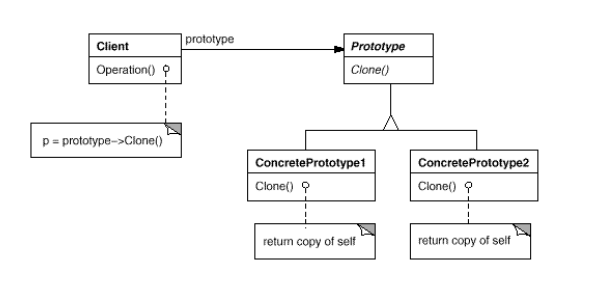

# Prototype

## Намерение
Този шаблон за дизайн се използва за създаване на инстанция от даден клас чрез клониране на вече съществуващ обект.
Определя видовете обекти за създаване чрез прототипна инстанция.
Създава обекти с клониране на един от няколко предварително съхранени прототипа.

## Мотив
Когато имаме нужда от създаване на високоструващ обект (отнема време и ресурси за създаването му), се използва този шаблон. Не се използва самото създаване на обектите, а тяхното клониране.
Шаблонът позволява на обекта да създаде конкретни, персонализирани обекти, като ги клонира, без да се знае техния клас или каквито и да е било подробности за това как да ги създаде.

## Участници
#### Prototype:
Декларира интерфейс за самото клониране.
#### Concrete Prototype:
Изпълнява операцията по клонирането.
#### Client:
Създава нов обект (клониран такъв), като казва на Prototype-а да се клонира.

## Приложимост
Шаблонът Prototype се използва когато:
*   Една система трябва да бъде независима от това как нейните продукти са създадени, съставени (съдържат полета и други) и как се представят.
*   Когато инстанцираните обекти са специфични по време на изпълнението на програмата.

## Свързани шаблони
Abstract Factory. Разликата е че, Abstract Factory-то може да се съхранява набор от прототипи, от които да се клонират и да се връщат обекти.

## Структура

